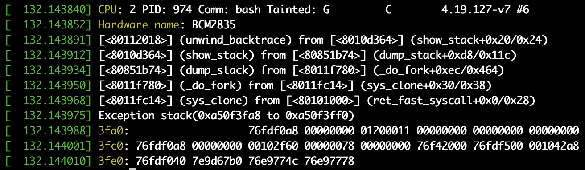

# dump_stack() 함수
커널에서 지원하는 dump_stack() 함수를 호출하면 콜 스택을 커널 로그로 볼 수 있습니다. \
dump_stack() 함수의 사용법은 커널 로그로 콜 스택을 보고 싶은 코드에 dump_stack() 함수를 추가하기만 하면 됩니다.

## dump_stack() 사용방법
```
#include <linux/kernel.h>
```
`dump_stack()` 함수를 호출하려면 코두의 윗부분에 위와 같이 "linux/kernel.h" 헤더 파일을 추가해야 합니다.

## dump_stack() 함수로 커널 로그에서 콜 스택 확인하기
### [sourcecode](https://github.com/raspberrypi/linux/blob/rpi-4.19.y/kernel/fork.c)
```c
static int debug_kernel_thread = 1;
long _do_fork(unsigned long clone_flags,
              unsigned long stack_start,
              unsigned long stack_size,
              int __user *parent_tidptr,
              int __user *child_tidptr,
              unsigned long tls)
{
        struct completion vfork;
        struct pid *pid;
        struct task_struct *p;
        int trace = 0;
        long nr;

		...

        p = copy_process(clone_flags, stack_start, stack_size,
                         child_tidptr, NULL, trace, tls, NUMA_NO_NODE);
        add_latent_entropy();

[+]        if (debug_kernel_thread) {
[+]                printk("[+][%s] process n", current->comm);
[+]                dump_stack();
[+]        }
```
### result


## dump_stack() 함수를 사용할때 주의사항
dump_stack() 함수를 호출해서 콜 스택을 보려는 코드가 자주 호출되는지 반드시 점검할 필요가 있습니다. \
dump_stack() 함수를 실행하면 내부에서 현재 실행 중인 프로세스 스택 주소를 읽어서 스택에 푸시된 프레임 포인터(Frame Pointer) 레지스터를 읽습니다. \
ARM 아키텍처의 함수 호출 규약에 따라 프레임 포인터 레지스터를 읽어서 함수 호출 내역을 추적하는 동작을 반복합니다.