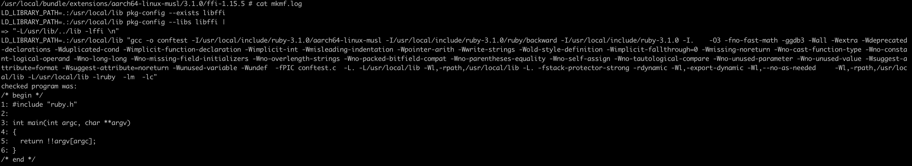
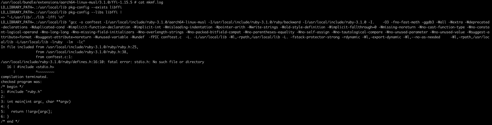
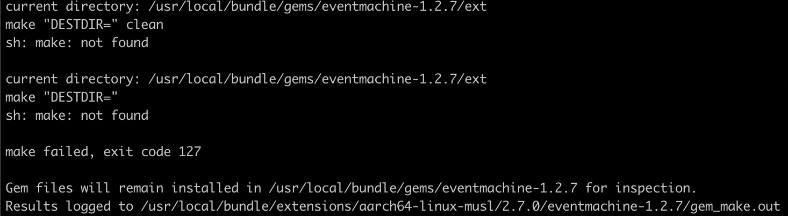
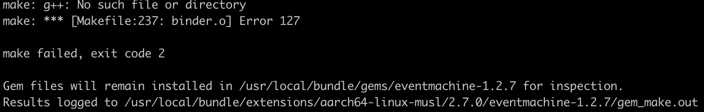

# **Jekyll**

## **목표**
* github.io를 이용하기 위한 Jekyll환경 구축.
* githubpage에서 사용하기 위한 ruby2.7 버전을 이용.
* 테마의 경우 유저마다 다름으로 Jekyll, bundler만 설치

## **발생한 문제**
* `Jekyll` 설치 시 에러 발생 및 `mkmf.log`확인.

`gcc`가 없어서 발생하는 문제임을 확인. \
`apk add gcc`를 이용해 `gcc`설치.
* `gcc`설치 이후 다른 에러가 발생 및 `mkmf.log`확인.

`libc`가 없어서 발생하는 문제임을 확인. \
`glibc`를 설치하려고 했으나 실패. \
https://www.lesstif.com/docker/alpine-linux-35356819.html 를 참조하여 `musl-dev` 설치
* `musl-dev`설치 이후 다른 에러 발생

`Make`설치
* `Make` 설치 이후 다른 에러 발생

`g++`이 없어서 발생하는 에러, `g++`설치

## **Dockerfile**
발생한 문제들을 기반으로 필요한 패키지를 `Dockerfile`에 기입.
```dockerfile
FROM ruby:2.7-alpine

# preinstall for jekyll
RUN apk update \
&&  apk add --no-cache \
	gcc \
	g++ \
	git \
	make \
	musl-dev \
	vim

# install jekyll & bundle
RUN gem install jekyll bundler

EXPOSE	4000

CMD [ "/bin/ash" ]
```

## **흥미로운 점**
`libc`와 관련해 모든 `linux`에서 패키지 관리자로 `glibc`를 설치 할 수 있을거라고 생각했음. \
`alpine`같은 경우 `apk add glibc`를 입력하면 패키지를 찾을수 없다는 결과 발생. \
`glibc`와 `musl-dev`의 `libc`프론트 코드의 차이에 대해 궁금해짐.
